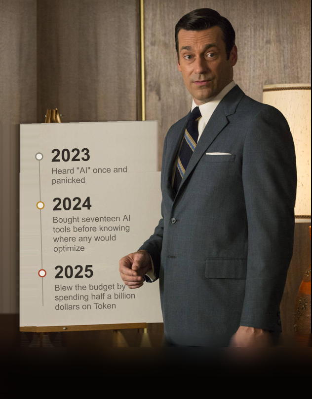

# UTM Jr. Apprentice Program — Inbound Marketing Cohort

This repository contains work from UTM's Q4 2026 Marketing Apprentice Program,
in which I was placed on the Outbound Marketing team.

## About the Program
Formerly Austin Urban Tech Movement, UTM runs a structured apprenticeship in 
which apprentices will present their culminating deliverables at Rethink Austin
November 14, 2026.
## How the Program is designed ##
 The Core Program Mechanics & Expectations:

-Focus on Performance: Students are expected to build operating speed and achieve reps at a professional standard rather than simply learning theoretical vocabulary.

-Client-Level Feedback: Work is evaluated directly against client expectations; students learn to handle real feedback when output is not good enough.

-Mentorship & Trade-off: Operates as a high-mentorship, unpaid structure for three months (~10 hours per week) leading to an up-or-out performance review at 12 months.

Execution & Collaboration: Students gain experience operating under real workplace speed, switching roles during team agenda meetings, managing tight weekly/monthly deadlines, and mastering collaboration tools in Google Suite.

## What's in this repo
Campaign strategy documents, outbound marketing assets, and project work
produced during the apprenticeship.

## Sprints
| # | Sprint | Status | Notes |
|---|--------|--------|-------|
| 01 | [Kickoff Sprint](./01-Kickoff-Sprint) | ✅ Complete | |
| 02 | [Interview Sprint](./02-Interview-Sprint) | ✅ Complete | [Audience research](./02-Interview-Sprint/Customer-Persona-Profile.md), Head-Heart-Hustle exercise |
| 03 | Final Campaign — Rethink Austin | ⬜ Not started | Presenting Nov 14, 2026 |
